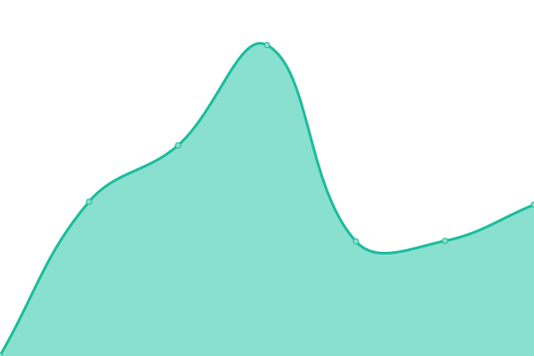
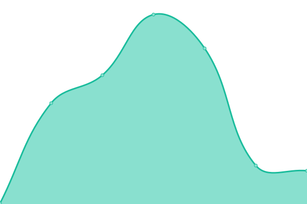
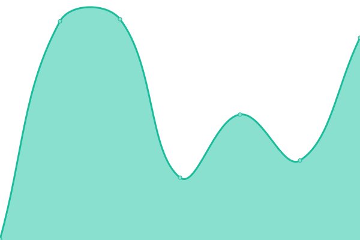
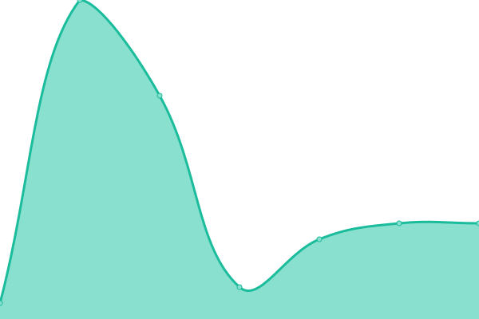
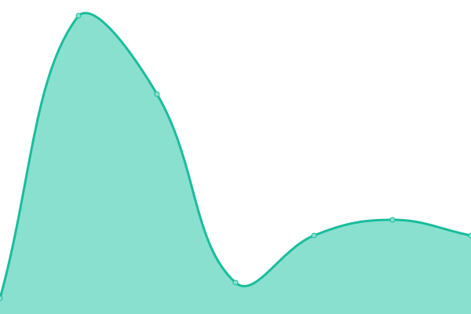

# [📈 Live Status](https://status.siteauditpro.com.au): <!--live status--> **🟩 All systems operational**

This repository contains the open-source uptime monitor and status page for [Upptime](https://upptime.js.org), powered by [Upptime](https://github.com/upptime/upptime).

With [Upptime](https://upptime.js.org), you can get your own unlimited and free uptime monitor and status page, powered entirely by a GitHub repository. We use [Issues](https://github.com/upptime/upptime/issues) as incident reports, [Actions](https://github.com/edwardcox/siteauditpro/actions) as uptime monitors, and [Pages](https://status.siteauditpro.com.au) for the status page.

<!--start: status pages-->
<!-- This summary is generated by Upptime (https://github.com/upptime/upptime) -->
<!-- Do not edit this manually, your changes will be overwritten -->
<!-- prettier-ignore -->
| URL | Status | History | Response Time | Uptime |
| --- | ------ | ------- | ------------- | ------ |
|  [FLECK](https://fleck.com.au) | 🟩 Up | [fleck.yml](https://github.com/edwardcox/siteauditpro/commits/HEAD/history/fleck.yml) | 

 880ms
     
 | 

<a href="https://status.siteauditpro.com.au/history/fleck">100.00%</a>
    

|  [Eagle Self Storage](https://eaglestorage.com.au) | 🟩 Up | [eagle-self-storage.yml](https://github.com/edwardcox/siteauditpro/commits/HEAD/history/eagle-self-storage.yml) | 

 542ms
     
 | 

<a href="https://status.siteauditpro.com.au/history/eagle-self-storage">100.00%</a>
    

|  [Site Audit Pro](https://siteauditpro.com.au) | 🟩 Up | [site-audit-pro.yml](https://github.com/edwardcox/siteauditpro/commits/HEAD/history/site-audit-pro.yml) | 

 373ms
     
 | 

<a href="https://status.siteauditpro.com.au/history/site-audit-pro">100.00%</a>
    

|  [Scintera Shopify Shop](https://scintera.com.au) | 🟩 Up | [scintera-shopify-shop.yml](https://github.com/edwardcox/siteauditpro/commits/HEAD/history/scintera-shopify-shop.yml) | 

 609ms
     
 | 

<a href="https://status.siteauditpro.com.au/history/scintera-shopify-shop">100.00%</a>
    

|  [Thin Systems](https://thin.com.au) | 🟩 Up | [thin-systems.yml](https://github.com/edwardcox/siteauditpro/commits/HEAD/history/thin-systems.yml) | 

 144ms
     
 | 

<a href="https://status.siteauditpro.com.au/history/thin-systems">100.00%</a>
    

|  [Google](https://www.google.com) | 🟩 Up | [google.yml](https://github.com/edwardcox/siteauditpro/commits/HEAD/history/google.yml) | 

 160ms
     
 | 

<a href="https://status.siteauditpro.com.au/history/google">100.00%</a>
    

|  [Apple](https://apple.com) | 🟩 Up | [apple.yml](https://github.com/edwardcox/siteauditpro/commits/HEAD/history/apple.yml) | 

 277ms
     
 | 

<a href="https://status.siteauditpro.com.au/history/apple">100.00%</a>
    

|  [Google DNS 1](8.8.4.4) | 🟩 Up | [google-dns-1.yml](https://github.com/edwardcox/siteauditpro/commits/HEAD/history/google-dns-1.yml) | 

 8ms
     
 | 

<a href="https://status.siteauditpro.com.au/history/google-dns-1">100.00%</a>
    

|  [Google DNS 2](8.8.8.8) | 🟩 Up | [google-dns-2.yml](https://github.com/edwardcox/siteauditpro/commits/HEAD/history/google-dns-2.yml) | 

 7ms
     
 | 

<a href="https://status.siteauditpro.com.au/history/google-dns-2">100.00%</a>
    

<!--end: status pages-->

[**Visit our status website →**](https://status.siteauditpro.com.au)

## 📄 License

- Powered by: [Upptime](https://github.com/upptime/upptime)
- Code: [MIT](./LICENSE) © [Upptime](https://upptime.js.org)
- Data in the `./history` directory: [Open Database License](https://opendatacommons.org/licenses/odbl/1-0/)
